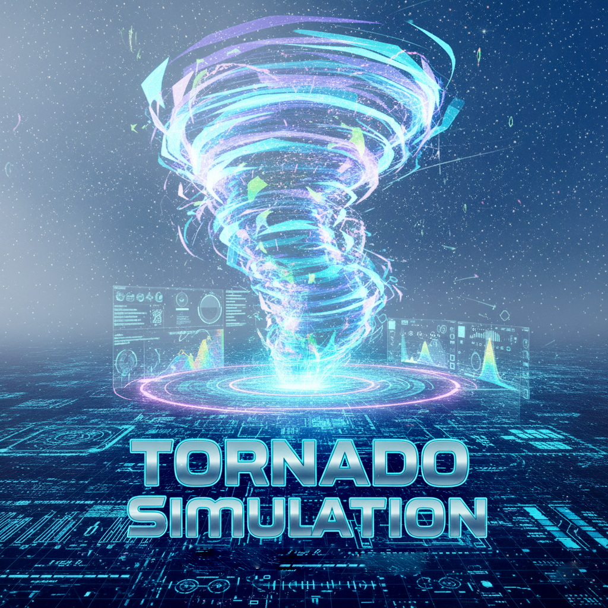

# Tornado Simulation : Objective

My objective is to explore various concepts in physics by formulating problems mathematically and conducting simulations. 
This approach will yield many interesting and valuable insights. It is still under construction. Other elements will be integrated soon.

Detailed Python Program Descriptions

- OneTwister.py: This program simulates the structural and physical behavior of a single twisted system, such as a moiré pattern or twisted bilayer material. It models geometric deformation, strain distribution, and relaxation effects using numerical methods. The script calculates energy minimization and visualizes resulting twisted configurations under varying twist angles and boundary conditions.

- TwoTwister.py: Extends the simulation framework to two coupled twisted structures, enabling analysis of interlayer interactions, coupling effects, and emergent properties. It solves coupled differential equations representing the mechanical and electronic interactions between the two twisted layers, providing insights into their combined behavior and stability.

- TwoTwisterFusion.py: Focuses on the fusion process of two twisted structures, simulating how their lattices merge and relax over time. The program models atomic rearrangements, defect formation, and energy landscape evolution during fusion, using iterative numerical solvers to capture complex structural transitions.

- TwoTwisterFusionAI.py: Integrates machine learning algorithms to enhance the simulation of twisted structure fusion. This script uses AI-driven optimization techniques to predict stable configurations, accelerate convergence of numerical solvers, and identify critical parameters influencing fusion outcomes. It combines physics-based modeling with data-driven approaches for improved accuracy and computational efficiency.

# Tornado Modeling Using Fluid Mechanics and Air Composition

## Introduction

A tornado is a highly concentrated, intense vortex of rotating air, typically manifesting as a vertically oriented column or funnel that extends from the base of a convective cloud—most commonly a cumulonimbus—to the Earth's surface. This atmospheric phenomenon is characterized by strong cyclonic rotation around a vertical axis, with wind speeds that can exceed 400 km/h. Upon ground contact, the tornado entrains particulate matter such as dust, debris, and moisture, creating a visible condensation funnel and causing significant mechanical damage.

The intensity of a tornado is primarily assessed through the Enhanced Fujita (EF) scale, which categorizes tornadoes from EF0 (weak) to EF5 (incredible strength) based on post-event damage surveys of man-made structures, vegetation, and other environmental indicators. Direct in-situ measurement of tornado wind velocities is challenging due to the transient nature and extreme turbulence within the vortex, thus necessitating damage-based estimation methods.

Tornado genesis is typically associated with severe convective storms under conditions of atmospheric instability and vertical wind shear, which promote the development of mesocyclones and subsequent vortex stretching. The interaction of strong updrafts and downdrafts concentrates angular momentum, leading to the formation of the tornadic vortex. Tornado lifetimes are generally short, ranging from several minutes up to an hour, but their localized destructive potential is substantial.

## Fluid Dynamics and Thermodynamics of Tornado Formation

Tornado formation is a complex interplay of atmospheric fluid dynamics and thermodynamics, involving the interaction of rotating air masses, vertical motions, and thermodynamic processes influenced by air composition and phase changes.

### Fluid Dynamics Aspects

- **Swirling, Converging Vortex Flow:**

  Tornadoes are realistically modeled as swirling, converging vortex flows where air near the surface converges and ascends rapidly in a rotating column. Laboratory and numerical studies show an outer inviscid region surrounding a viscous core, which captures the intense rotation and velocity gradients observed in tornadoes.

- **Vertical Vorticity Generation and Stretching:**

  The generation of vertical vorticity near the ground is critical. This vorticity arises primarily through the tilting and stretching of horizontal vorticity produced by wind shear and baroclinic effects (density gradients). Downdrafts and gust fronts create horizontal vorticity that is tilted vertically by the updraft, intensifying rotation to tornadic strength.

- **Role of Updrafts and Downdrafts:**

  The interaction of strong updrafts with rear-flank downdrafts in supercell thunderstorms creates conditions favorable for tornadogenesis. The updraft stretches the vortex vertically, while the downdraft transports horizontal vorticity downward to the surface, where it can be intensified.

- **Pressure Drops and Suction Effect:**

  Rapid rotation leads to a low-pressure core inside the tornado, generating a strong pressure gradient force ("suction") that accelerates air inward and upward. This effect enhances convergence near the surface and supports the maintenance and intensification of the vortex.

- **Surface Friction and Vorticity:**

  Surface friction generates additional horizontal vorticity, which can be ingested into the tornado vortex. This frictionally generated vorticity plays a role in the early stages of tornadogenesis and in maintaining the vortex near the ground.

### Thermodynamics and Air Composition

- **Equation of State and Density Variations:**

  The air density ρ depends on pressure, temperature, and composition (notably water vapor content). Tornado dynamics are influenced by these density variations, which affect buoyancy and pressure fields.

- **Water Vapor Condensation and Latent Heat Release:**

  Condensation of water vapor within the updraft releases latent heat, which warms the air, reduces density, and enhances buoyancy. This process intensifies the updraft and contributes to the low-pressure core of the tornado.

- **Baroclinic Generation of Vorticity:**

  Horizontal gradients in temperature and density (baroclinicity) near gust fronts generate horizontal vorticity. This vorticity is a key source for vertical rotation when tilted by updrafts.

- **Density Decrease in Ascending Jets:**

  Hydrodynamic models suggest that the formation of an atmospheric vortex like a tornado requires significant decrease in air density within ascending jets. This density decrease, amplified by condensation, can create positive feedback that intensifies the vortex and explains the characteristic funnel shape extending to the ground.

### Summary of Tornadogenesis Mechanism

- Large-scale storm dynamics produce wind shear and horizontal vorticity.
- Downdrafts transport horizontal vorticity to the surface.
- Strong updrafts tilt and stretch this vorticity vertically, intensifying rotation.
- Latent heat release and density variations enhance buoyancy and pressure gradients.
- Surface friction contributes additional vorticity.
- The combined effect leads to the formation of a low-pressure, rapidly rotating vortex column—the tornado.

## The Complete Mathematical Model of a Tornado

The complete mathematical model of a tornado combines:

- Compressible or incompressible Navier-Stokes equations with rotation.
- Continuity equation.
- Air equation of state depending on composition.
- Energy equation accounting for thermal exchanges and phase changes.
- Vorticity and swirl definitions to characterize intense rotation.

These equations form the basis for complex numerical simulations (CFD) of tornado formation and dynamics.

### Physical Assumptions

- The tornado is a swirling flow, often approximated as axisymmetric around a vertical axis Oz.
- Air can be considered a compressible fluid, but often the incompressibility assumption is retained to simplify (small density variations except for strong thermal changes).
- The composition of air (mainly N₂, O₂, water vapor, CO₂) influences the density ρ, the pressure p, and the temperature T, via the equation of state.

### Basic Equations in Fluid Mechanics

#### Mass Conservation (Continuity)

For an incompressible fluid (ρ = constant):

$$
\nabla \cdot \vec{v} = 0
$$

#### Momentum Conservation (Navier-Stokes Equation)

- v : velocity vector
- p : pressure
- ρ : density (function of composition and temperature)
- g : gravity
- μ : dynamic viscosity
- F : additional forces (e.g., Coriolis forces, electromagnetic forces negligible here)

$$
\rho \left( \frac{\partial \vec{v}}{\partial t} + (\vec{v} \cdot \nabla) \vec{v} \right) = - \nabla p + \mu \nabla^2 \vec{v} + \rho \vec{g} + \vec{F}_{\mathrm{autres}}
$$

#### Equation of State of Air (Modified Ideal Gas)

The density ρ depends on pressure, temperature, and composition:

$$
\rho = \frac{p}{R_{\mathrm{sp}} T}
$$

with R_sp = R/M the specific gas constant, R the universal gas constant, and M the average molar mass of air, depending on the composition (molar fraction of different gases).

#### Energy Equation (Thermodynamics)

To account for temperature and composition variations:

- c_p : heat capacity at constant pressure (function of composition)
- k : thermal conductivity
- Φ : viscous dissipation
- Q : heat sources/sinks (e.g., water vapor condensation)

$$
\rho c_p \left( \frac{\partial T}{\partial t} + \vec{v} \cdot \nabla T \right) = k \nabla^2 T + \Phi + Q
$$

### Specific Modeling of a Tornado (Axisymmetric Swirling Flow)

In cylindrical coordinates (r,θ,z) with symmetry around the axis z, the velocity is often written as:

$$
\vec{v} = v_r \vec{e}_r + v_\theta \vec{e}_\theta + v_z \vec{e}_z
$$

#### Vorticity (Swirl)

The vorticity vector ω⃗ is defined by:

$$
\vec{\omega} = \nabla \times \vec{v}
$$

The swirl is half the vorticity:

$$
\vec{\xi} = \frac{1}{2} \vec{\omega}
$$

In a tornado, the main component of vorticity is axial (z).

#### Example of a Simplified Velocity Field (Rankine Vortex)

- For r < a (tornado core): solid body rotation
- For r > a (outside): irrotational potential flow

with Γ = 2πΩ₀a² the circulation.

$$
v_\theta(r) = \begin{cases}
\Omega_0 r & \mathrm{if}\ r < a \\
\frac{\Gamma}{2\pi r} & \mathrm{if}\ r > a
\end{cases}
$$

#### Modified Bernoulli Equation (Ideal, Steady Fluid)

Along a streamline:

$$
\frac{p}{\rho} + \frac{v^2}{2} + gz = \mathrm{constant}
$$

with v² = v_r² + v_θ² + v_z².

### Integration of Air Composition

- The density ρ depends on the gaseous composition and temperature via the equation of state.
- Water vapor present in air modifies the average molar mass M and thus the specific constant R_sp.
- Thermal variations due to water vapor condensation (latent heat release) influence the dynamics via the energy equation.

## Key References for Further Reading

- Lewellen, D.C., & Lewellen, W.S. (2007). *Fluid Dynamics of a Tornado-Like Vortex Flow*. NOAA Technical Report.
- Markowski, P., & Richardson, Y. (2015). *Tornado and Tornado Dynamics*. University of Oklahoma.
- Markowski Research Group. *How Tornadoes Form* (2017).
- Shtemler, Y.M., Golbraikh, E., & Mond, M. (2019). *On the Mechanism of Atmospheric Vortex Formation*.
- Orf, L.G., & Lee, W.-C. (2022). *Transition of Near-Ground Vorticity Dynamics during Tornadogenesis*. Journal of the Atmospheric Sciences.
- Lewellen, D.C. (2013). *The Fluid Dynamics of Tornadoes*. Annual Review of Fluid Mechanics.
- Lewellen, D.C., & Lewellen, W.S. (1976). *Mechanism of Tornado Funnel Formation*. Physics of Fluids.
- Lewellen, D.C., & Lewellen, W.S. (2017). *Dynamics and Thermodynamics of a Tornado: Rotation Effects*. Atmospheric Research.

## References

- [1] [Fluid Dynamics of a Tornado-Like Vortex Flow](https://repository.library.noaa.gov/view/noaa/48797/noaa_48797_DS1.pdf)
- [2] [Tornado and Tornado Dynamics](https://twister.caps.ou.edu/MM2015/Chapter4.7.pdf)
- [3] [How Tornadoes Form](https://sites.psu.edu/pmarkowski/how-tornadoes-form/)
- [4] [On the Mechanism of Atmospheric Vortex Formation](https://ej-physics.org/index.php/ejphysics/article/download/1/2/14)
- [5] [Transition of Near-Ground Vorticity Dynamics during Tornadogenesis](https://journals.ametsoc.org/downloadpdf/view/journals/atsc/79/2/JAS-D-21-0181.1.pdf)
- [6] [The Fluid Dynamics of Tornadoes](https://www.annualreviews.org/content/journals/10.1146/annurev-fluid-011212-140639)
- [7] [Mechanism of Tornado Funnel Formation](https://pubs.aip.org/aip/pfl/article/19/12/1853/823950/Mechanism-of-tornado-funnel-formation)
- [8] [Dynamics and Thermodynamics of a Tornado: Rotation Effects](https://www.sciencedirect.com/science/article/abs/pii/S0169809516300886)

